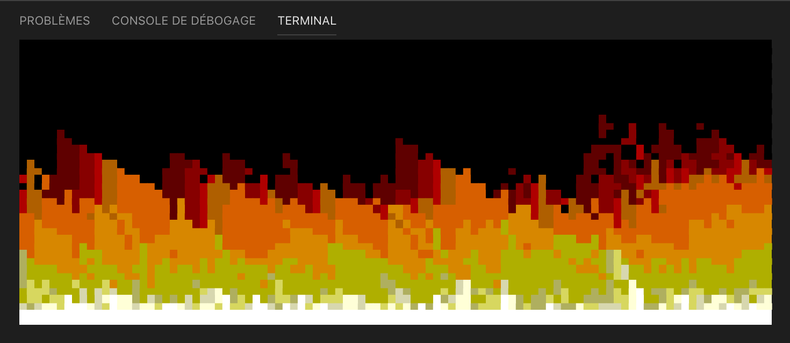

# Doom Fire

This project was inspired by the Fabien Sanglard's [article](http://fabiensanglard.net/doom_fire_psx/).

It generates a fire static image (for now) in your terminal.



## Build the project

### With make

If `go` and `make` are installed on your computer, you can simply run

```shell
make
```

in the project directory to build the binary file.

Be careful to respect the project path in your go installation: `$GOPATH/src/github.com/juliendoutre/doom-fire`.

### With Docker

If you wish to build the executable in a Docker container, you can run

```shell
docker build -t doom-fire:1.0 .
docker run --rm -v "$PWD":/go/src/github.com/juliendoutre/doom-fire doom-fire:1.0 make
```

in the project directory.

You can specify the architecture, by passing variables to make:

```shell
docker run --rm -v "$PWD":/go/src/github.com/juliendoutre/doom-fire doom-fire:1.0 make GOARCH=amd64 GOOS=darwin
```

## Run the program

You can run the program simply with:

```shell
./doom-fire
```

You can set some parameters using the following flags:
* `-w int` to set the canvas width *(default 100)*
* `-h int` to set the canvas height *(default 37)*
* `-t float` to set a threshold value modifying the fire decay speed (it also influences the wind force) *(default 4.5)*

## Run the tests

To run the project tests, you can use `make` and run

```shell
make test
```

or Docker and run

```shell
docker run --rm doom-fire:1.0 make test
```

### Tests coverage

You can see the tests coverage by running

```shell
make cover
```

or

```shell
docker run --rm doom-fire:1.0 make cover
```

### Tests race

Run

```shell
make race
```

or

```shell
docker run --rm doom-fire:1.0 make race
```

to run the concurrency tests.

## Documentation

Godoc allows to deploy a local server exposing a package documentation.

If `godoc` is installed on your computer, run

```shell
godoc -http <port>
```

and navigate to `http://localhost:<port>/pkg/github.com/juliendoutre/doom-fire/` to see the project's documentation.

You can install godoc with

```shell
go get golang.org/x/tools/cmd/godoc
```

You can also use Docker:

```shell
docker run --rm -p <port>:<port> doom-fire:1.0 godoc -http :<port>
```

and go to the same address on your browser.

## Roadmap

* add dynamic animation
* add tests