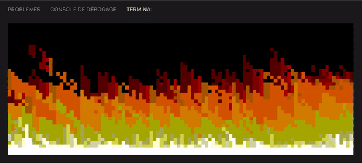

# Doom Fire 🔥

This project was inspired by the Fabien Sanglard's [article](https://fabiensanglard.net/doom_fire_psx/).

It generates a fire simulation in your terminal.



It uses the [termloop](https://github.com/JoelOtter/termloop) library for the display.

## Build the project

### With make

If `go` and `make` are installed on your computer, you can simply run

```shell
make
```

in the project directory to build the binary file.

### Cross build

Run

```shell
make cross
```

to build the binary for the following architectures:

- linux/amd64
- linux/386
- windows/amd64
- windows/386
- darwin/amd64
- darwin/386

## Run the program

You can run the program with:

```shell
./doom-fire
```

You can set some parameters using the following flags:

- `-w <int>` to set the canvas width _(default 100)_
- `-h <int>` to set the canvas height _(default 37)_
- `-t <float>` to set a threshold value modifying the fire decay speed (it also influences the wind force) _(default 4.5)_

You can the keyboard arrows to increase or decrease the fire propagation force (`UP` and `DOWN`) and the wind direction (`LEFT` and `RIGHT`).

## Run the tests

To run the project tests, you can use `make` and run

```shell
make test
```

The tests coverage is displayed in `.coverage.html`.

## Documentation

Godoc allows to deploy a local server exposing a package documentation.

If `godoc` is installed on your computer, run

```shell
godoc -http <port>
```

and navigate to `http://localhost:<port>/pkg/github.com/juliendoutre/doom-fire/` to see the project's documentation.

You can install godoc with

```shell
go get golang.org/x/tools/cmd/godoc
```
